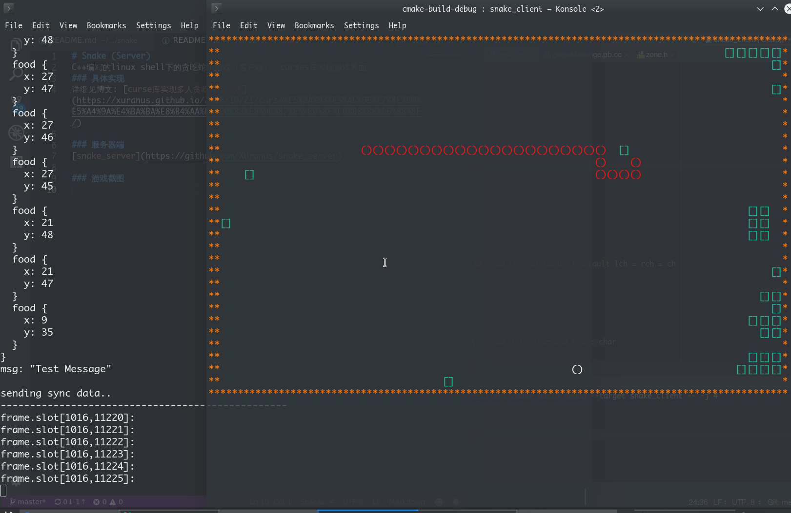

# SnakeGame （贪吃蛇）
C++编写的linux下的贪吃蛇小游戏，支持多人对战，

## Require
 - C++11
 - protobuf-compiler
 - libcurses
  
## Install
```
#ubuntu
sudo apt intstall protobuf-compiler libncurses5-dev
./build.sh
```

## Run
 - Server
```
sudo ./snake_server -p 999 -n 1 #单人模式
```
 - Clients
```
./snake_client -H 127.0.0.1 -p 999
```

## Server
 - chrono计时器实现帧同步
 - select非阻塞IO
 - 基于protobuf的二进制流通信。

详细见博文: [curse库实现多人贪吃蛇小游戏](https://xuranus.github.io/2018/10/21/curse%E5%BA%93%E5%AE%9E%E7%8E%B0%E5%A4%9A%E4%BA%BA%E8%B4%AA%E5%90%83%E8%9B%87%E5%B0%8F%E6%B8%B8%E6%88%8F/)

## Client
libcurses实现游戏界面

### 游戏截图



