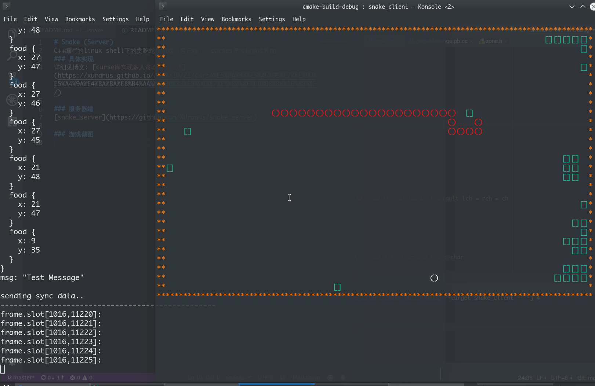

# Snake (Client)
C++编写的linux shell下的贪吃蛇小游戏（客户端），curses库实现游戏界面

### 具体实现
详细见博文: [curse库实现多人贪吃蛇小游戏](https://xuranus.github.io/2018/10/21/curse%E5%BA%93%E5%AE%9E%E7%8E%B0%E5%A4%9A%E4%BA%BA%E8%B4%AA%E5%90%83%E8%9B%87%E5%B0%8F%E6%B8%B8%E6%88%8F/)

### 游戏截图


### Build
```
cd path/to/project
mkdir build
cd build
cmake ..
make
```